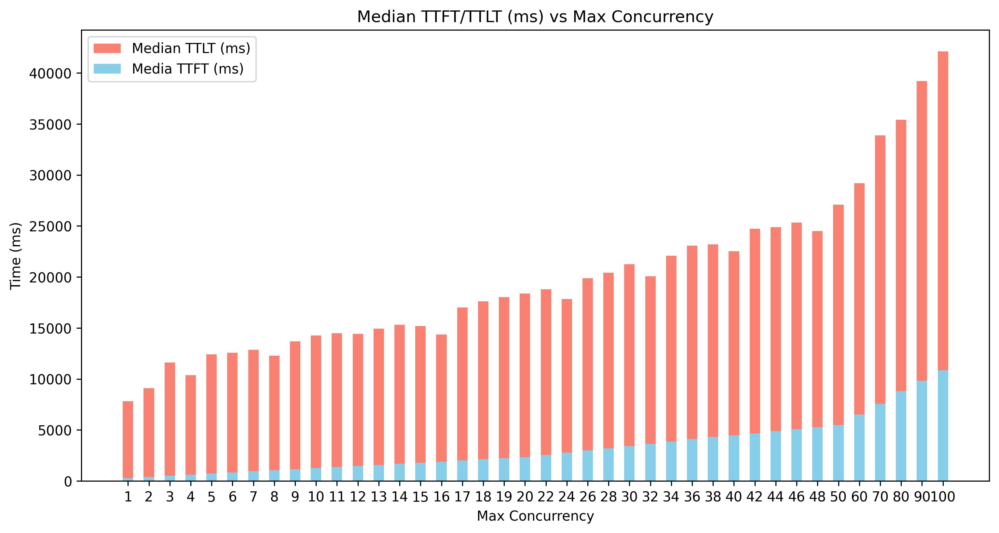
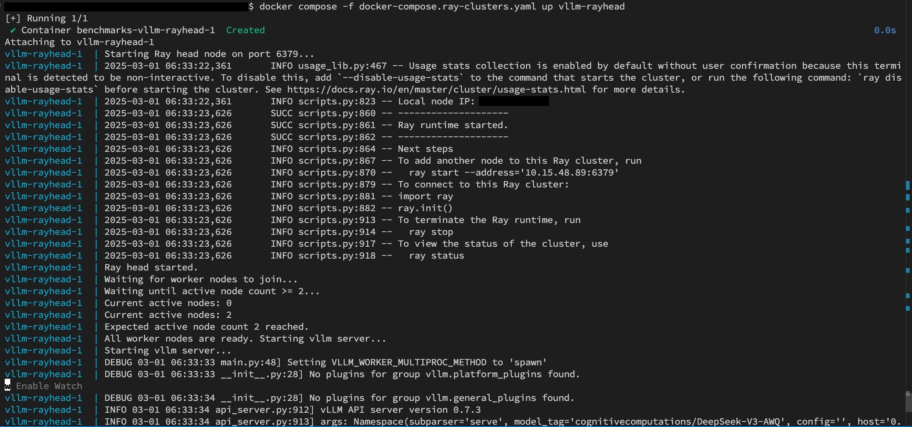
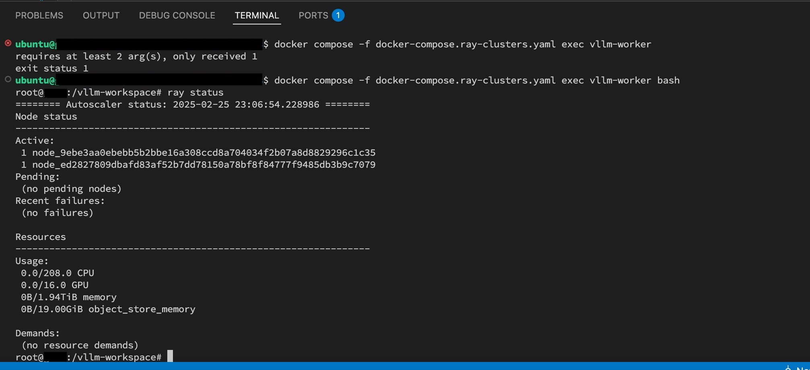
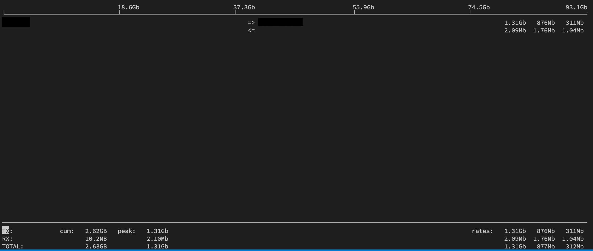

# Deploy DeepSeek-V3/R1 671B on 8xH100 and Throughput Benchmarks

This document provides a comprehensive guide for deploying the DeepSeek V3/R1 671B model with serving on a single machine with 8xH100 GPUs. It also contains detailed performance throughput benchmarks under various parameter configurations. This document is intended to help users understand the deployment process as well as the service capabilities provided within a hardware resource environment.


## Table of Contents

[I. Deployment Environment and System Configuration](#deployment-environment-and-system-configuration)

[II. Environment Setup and Benchmarking](#environment-setup-and-benchmarking)

[III. Benchmarking LLM Throughput and Concurrency](#benchmarking-llm-throughput-and-concurrency)

[IV. Comparative Analysis](#comparative-analysis)

[V. Multi-Node Deployment and Testing under Kubernetes](#multi-node-deployment-and-testing-under-kubernetes)

---


## Deployment Environment and System Configuration

The deployment has been tested on a high-performance machine configured with the following hardware components:

- 8× NVIDIA H100 SXM5 GPUs
- 104 Intel Xeon Platinum 8470 CPUs
- 1024GB DDR5 RAM
- 100 Gbps Ethernet connectivity

The software stack includes:

- vLLM version 0.7.3
- Docker with NVIDIA-Container-Runtime

Additionally, the following models are utilized:

- cognitivecomputations/DeepSeek-V3-AWQ
- cognitivecomputations/DeepSeek-R1-AWQ

This environment ensures that the DeepSeek V3/R1 671B model is deployed efficiently, enabling extensive throughput benchmarking and serving capabilities on a single machine setup.


**Why Use the 4-Bit AWQ Quantized Model?**

Deploying the full-scale 671B DeepSeek V3 model in FP8 would require an enormous amount of GPU memory (FP16 can reach around 1.4TB in VRAM). For example, the model’s 671B main parameters plus an additional 14B MTP parameters already demand around 685GB of VRAM when stored in FP8. With 8xH100 GPUs offering a total of 640GB VRAM, this setup falls short of the requirements.

Under AWQ, the model's 671B parameters are quantized from 8-bit to 4-bit, reducing weight storage to approximately 335GB. Additionally, there are about 37B activated parameters stored in FP16, taking up roughly 37GB. Combined, this consumes around 400GB of VRAM, allowing the model to run on an 8×H100 setup with 640GB VRAM and leaving ample space for cache during serving deployment.


It can be seen that loading the model weights consumes 50GB of VRAM, and with 8 GPUs, it amounts to about 400GB of VRAM, which is consistent with the computation.


## Environment Setup and Benchmarking

### Prerequisites  
Make sure you have the following before proceeding:  
- Ubuntu 22.04  
- NVIDIA drivers installed

### Base Environment Installation  
Install Docker and NVIDIA Container Runtime. You can follow the official documentation.

```shell
# Docker 
https://docs.docker.com/engine/install/ubuntu/
# Nvidia Container Toolkit
https://docs.nvidia.com/datacenter/cloud-native/container-toolkit/latest/install-guide.html
```

Or use the provided setup script:

```shell
./deploy/scripts/env_setup.sh
```

### Setting Up the vLLM Environment  

Navigate to the `deploy/benchmarks` directory. Create a `.env` file and set your Hugging Face token along with any other necessary environment variables:

```shell
HF_TOKEN=...
```

### Running the vLLM Server

Execute the following command to start the vllm server. Customize the parameters (e.g., `MODEL`, `TENSOR_PARALLEL_SIZE`, etc.) as needed:

```shell
MODEL=cognitivecomputations/DeepSeek-V3-AWQ \
    TENSOR_PARALLEL_SIZE=8 \
    PIPELINE_PARALLEL_SIZE=1 \
    MAX_MODEL_LEN=8000 \
    MAX_NUM_SEQS=128 \
    docker compose -f docker-compose.yaml up vllm-server
```

### Running the Benchmark

To execute the benchmark, run the appropriate commands as outlined in our instructions. For more details about how to run benchmarks and configure the environment, please refer to [Benchmarks Utils](./deploy/benchmarks/README.md).


## Benchmarking LLM Throughput and Concurrency

This section evaluates the service's performance by measuring throughput under different concurrency limitations on the server.

vLLM config

```shell
MODEL=cognitivecomputations/DeepSeek-V3-AWQ
TENSOR_PARALLEL_SIZE=8
PIPELINE_PARALLEL_SIZE=1
MAX_MODEL_LEN=8000
MAX_NUM_SEQS=128
```

Benchmarks config

```shell
# input token is 1024, output token is 256
-i 1024 -o 256 
```

**Concurrency 1-5 Throughput**


When Max Concurrency is set to 1, it can be observed that under a single-user request, the token output throughput is around 33 tokens per second. For a model of the 671B scale, this performance is not too bad. Naturally, as the level of concurrency increases, the total throughput rises and the device utilization improves.


**Concurrency 1-200 Throughput**


In tests covering scenarios with concurrency levels from 1 to 200, the data shows that when concurrency reaches about 100, the throughput has peaked—yielding a total token throughput of roughly 3000 and an output token throughput of about 620. Some might question whether this ceiling is due to the limitations imposed by vLLM’s `MAX_NUM_SEQS` setting, which might prevent running more tasks concurrently. In the tests for concurrency throughput from 1 to 200, the tests for 1–120 concurrency were conducted with `MAX_NUM_SEQS` set to 128, while those for 100–200 concurrency were run with `MAX_NUM_SEQS` set to 200. Comparing the collected data, no improvement was observed. Furthermore, monitoring in vLLM shows that although a larger `MAX_NUM_SEQS` was set, not all tasks marked as running are actually executed—instead, once the number of running tasks exceeds around 100, they begin to enter a pending state.


**Does a higher level of concurrency, implying greater throughput, necessarily mean better performance?** 

Not necessarily. The growth in token output throughput is in fact much lower than the increase in input throughput; the boost in input throughput is largely due to techniques such as `prefix caching` and `chunked prefill`. However, there is little improvement in the output efficiency of the model's decoder stage. Moreover, more concurrency only serves to distribute the response latency evenly across each request. Below is a comparison of ITL (Inter-token Latency) under different concurrency levels.

**Concurrency 1-100 ITL**


For example, if business requirements stipulate that the inter-token response latency must not exceed 50ms, the chart shows that when concurrency reaches 15, the latency is already close to this limit. With any higher level of concurrency, the latency will exceed the requirement.

However, one observation is that when max concurrency is set to 15, the token output throughput is about 250. Dividing 250 by 15 gives roughly 17, meaning that on average, a user receives about 17 tokens per second. Dividing 1000 by 17 yields approximately 58, which in practice slightly exceeds the 50ms requirement, because these statistics only reflect the median ITL. One can also compare the Mean ITL and P99 ITL values. It becomes evident that imposing a P99 requirement of 50ms per request is extremely stringent for such ultra-large parameter models.


Of course, if the response time requirement is relaxed to 200ms, even a single node can still provide reasonable levels of concurrency and throughput.


Regarding TTFT (Total Time to First Token) and TTLT (Total Time to Last Token), as the token output throughput is limited, the time until the first token appears is also notably affected by the level of concurrency. When the concurrency reaches 8, the first token does not appear until after 1 second.

**Concurrency 1-24 TTFT/TTLT**


**Concurrency 1-100 TTFT/TTLT**




**How does the model's processing performance behave under different QPS?** 

**QPS 1-20: Server vs Client Request Rate** 


It can be seen that when the server's processing speed reaches 2.75 QPS.


## Comparative Analysis

**In practical applications, what about cases with a large number of input tokens?** 

A common scenario is when the input consists of 4K tokens. Compare, for example, the throughput of inputs with 4K tokens versus 1K tokens.


**TTFT/TTLT vs Request Rate**


**Token Throughput vs Server Request Complete Rate**


**Server vs Client Request Rate**


From the chart, it can be seen that when processing an input of 4K tokens, although the overall token throughput quickly reaches a peak of nearly 3800, the output token throughput stops increasing once it reaches around 200. While the overall throughput shows slight growth, the efficiency of output tokens is reduced. Handling long token inputs is a significant challenge.


**Will there be differences in throughput performance between Deepseek-V3 and Deepseek-R1?**

From a technical architecture perspective, although both models have similar model architectures, their training architectures differ, and differences in performance and behavior may exist.

This comparison is between the V3 model—with an input token limit of 1K and an output token limit of 256—and the R1 model.


From the chart, it can be seen that the TTFT and throughput of the V3 and R1 models do not differ, but the response latency of the R1 model is slightly slower than that of V3. As a result, the TTLT for R1 is lower than that of V3, which means that the overall QPS will also be lower.


**The R1 model is a reasoning model, which typically means it produces long token outputs. In cases of long token outputs, would there be any performance differences?**

Compare the scenario where the input token about 1K with an output of 256 tokens against the scenario where the output token count is 1K.


It can be seen that, due to the fixed input length, the TTFTs are essentially overlapping, and differences in the number of output tokens have no impact.


The larger the number of output tokens, the overall token throughput is significantly reduced. 


**vLLM vs SGLang**

In addition to vLLM, there are other excellent open-source projects for model serving, such as SGLang ([https://github.com/sgl-project/sglang ](https://github.com/sgl-project/sglang)).

Here, we also perform a throughput comparison under max concurrency.

**Concurrency 1-5**


**Concurrency 1-14**


**TTFT/TTLT**


**Median/P99 ITL**


It can be seen that in terms of concurrent throughput, SGLang is much lower than vLLM. Also, while the ITL latency is overall higher with SGLang, the TTFT is relatively lower, allowing the model to output immediately. The official SGLang documentation states that deploying V3 would yield higher efficiency, but I found that the benchmarks are using an 8-card H200 setup or a 2-node, 8-card H100 setup. Is this issue due to the configuration of my deployed SGLang server, or has there been no optimization for concurrent processing of ultra-large parameter AWQ quantized models?


**H100 FP8 vs FP16**

AWQ quantization uses a W4A16 scheme, which means that after dequantization, activations are computed in FP16. According to the H100 performance report, FP8 offers better performance than FP16.

In the TensorRT-LLM report (https://github.com/NVIDIA/TensorRT-LLM/blob/main/docs/source/blogs/quantization-in-TRT-LLM.md), the speedup achieved when comparing FP8 to FP16 is about 1.4×.


Referencing Neuralmagic’s DeepSeek FP8 MLA optimization report (https://neuralmagic.com/blog/enhancing-deepseek-models-with-mla-and-fp8-optimizations-in-vllm/ ), under TP8PP2 H100 testing, a single node with 8 H100 GPUs achieved an output token throughput of 821.


In contrast, in tests on 8×H100 using AWQ, the output token throughput was approximately 620. This performance ratio is consistent with my own test results. Therefore, if sufficient hardware resources are available, deploying FP8 Serving can further enhance service capabilities. However, if limited to a single node, the AWQ quantized model—while not fully maximizing performance—still offers very good speed and quality.

Furthermore, with the gradual introduction of next-generation high-end chips like the H200 and B200, we can expect even greater performance improvements.


## Multi-Node Deployment and Testing under Kubernetes

In a multi-node environment, to deploy vLLM we can use the Ray provided by vLLM to build a Ray cluster for pipeline parallelism.

Ray head node: 

```yaml
  vllm-rayhead:
    hostname: node
    image: vllm/vllm-openai
    deploy:
      resources:
        reservations:
          devices:
            - capabilities: [gpu]
              device_ids: ['0,1,2,3,4,5,6,7']
    volumes:
      - ~/.cache/huggingface:/root/.cache/huggingface
      - ./ray-clusters/run_ray_cluster.sh:/app/run_ray_cluster.sh
    env_file:
      - ../.env
    shm_size: '10g'
    entrypoint: ["/bin/bash", "-c"]
    command: ["/app/run_ray_cluster.sh --head --port=6379"]
    # Uncomment to enable IB
    # devices:
    #   - /dev/infiniband:/dev/infiniband
    # Uncomment to use host network
    # network_mode: host
    # privileged: true
    environment:
      MODEL: Infermatic/Llama-3.3-70B-Instruct-FP8-Dynamic
      NUM_SEQS: 128
      TENSOR_PARALLEL_SIZE: 8
      PIPELINE_PARALLEL_SIZE: 2
      # Uncomment to setup raycluster device info
      # # VLLM config
      # VLLM_HOST_IP: <NODE_IP>
      # VLLM_LOGGING_LEVEL: DEBUG
      # # NCCL config
      # GLOO_SOCKET_IFNAME: <IFNAME>
      # NCCL_SOCKET_IFNAME: <IFNAME>
      # NCCL_DEBUG: TRACE
      # NCCL_IB_HCA: mlx5
      # # NCCL_IB_DISABLE: 0
    ports:
      - 8000:8000
```

Ray worker node 

```yaml
  vllm-worker:
    hostname: node
    image: vllm/vllm-openai
    deploy:
      resources:
        reservations:
          devices:
            - capabilities: [gpu]
              device_ids: ['0,1,2,3,4,5,6,7']
    volumes:
      - ~/.cache/huggingface:/root/.cache/huggingface
      - ./ray-clusters/run_ray_cluster.sh:/app/run_ray_cluster.sh
    env_file:
      - ../.env
    shm_size: '10g'
    entrypoint: ["/bin/bash", "-c"]
    command: ["/app/run_ray_cluster.sh --worker"]
    # Uncomment to enable IB
    # devices:
    #   - /dev/infiniband:/dev/infiniband
    # Uncomment to use host network
    # network_mode: host
    # privileged: true
    environment:
      RAYHEAD_ADDRESS: vllm-rayhead:6379
      # Uncomment to setup raycluster device info
      # # VLLM config
      # VLLM_HOST_IP: <NODE_IP>
      # VLLM_LOGGING_LEVEL: DEBUG
      # # NCCL config
      # GLOO_SOCKET_IFNAME: <IFNAME>
      # NCCL_SOCKET_IFNAME: <IFNAME>
      # NCCL_DEBUG: TRACE
      # NCCL_IB_HCA: mlx5
      # # NCCL_IB_DISABLE: 0
```

On two nodes, run the ray head and ray worker respectively.

Once the ray head starts, it will wait for workers to join until the required node conditions are met.



After the worker joins, checking the ray status shows that all resources are ready—16 GPUs.




Because my environment does not have an IB device, I configured it by setting NCCL_IB_DISABLE: 0 to disable IB, which will make the nodes communicate via SOCKET. (This method is only for debugging and demonstration, as the slower communication speed will negatively impact performance.)


After loading the model, you can see that the model weights only occupy 26GB of VRAM, with more VRAM reserved for the KVCache.

When running benchmark inference, you can observe a high volume of communication in the network status; however, the performance is severely impacted due to network bandwidth limitations.




**Benchmarking on 2 nodes with 8xH100 GPUs without IB**


From the chart, it can be seen that due to communication bottlenecks, throughput hasn't improved dramatically and only reached around 4500. However, when measuring by output tokens, the primary bottleneck is the decoder's performance. With double the GPUs, even with limited communication performance, it reached above 980—nearly a twofold improvement. The QPS performance shows a similar pattern.


**Deploy on Kubernetes**

In production environments, multi-node management is often handled through cloud platforms such as Kubernetes. So, how can we configure it under Kubernetes?

With the above docker-compose configuration, it can be easily transformed into a Kubernetes deployment.

The only thing to note is the mechanism by which the current cloud platform manages GPU resources and how to request allocation. For example, by setting the deployment’s runtime as follows:

```yaml
runtimeClassName: nvidia
```

or by configuring tolerations, nodeSelector, etc.:

```yaml
tolerations:
  - key: nvidia.com/gpu
    operator: Exists
    effect: NoSchedule
nodeSelector:
  kubernetes.io/hostname: g505
```

Also, consider how to mount persistent directories, especially if IB (InfiniBand) devices are involved—configure the corresponding device.

With Helm, you can quickly deploy templates. Then, by combining with Terraform and other tools, you can implement IaaS to manage resources more easily.

Of course, for model serving or training, Kubernetes is not strictly necessary. In particular, multi-node communication and device management are very complex tasks. Moreover, containerized platforms may incur certain latencies in resource scheduling. Using solutions like **Slurm** is another good alternative.